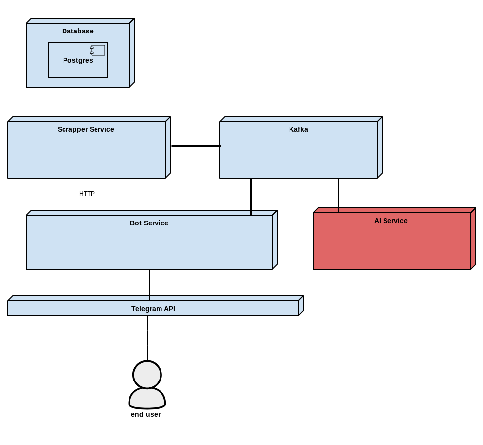

# LinkTracker

**LinkTracker** – Telegram-бот, который отслеживает изменения на веб-страницах и оперативно информирует пользователя о них.

## Architecture



### Services description

#### **Bot Service**

Отвечает за взаимодействие с пользователями через Telegram Bot API:

- Регистрация и авторизация пользователей
- Обработка команд (/track, /untrack, /list и др.)
- Управление подписками через взаимодействие со Scrapper Service
- Отправка уведомлений пользователям
- Хранение данных о пользователях и их настройках

#### **Scrapper Service**

Осуществляет мониторинг контента:

- Периодическая проверка отслеживаемых URL на наличие изменений
- Парсинг контента с различных источников (GitHub, Stack Overflow, Reddit и др.)
- Определение изменений (diff detection)
- Отправка уведомлений в Bot Service при обнаружении обновлений
- Хранение информации о подписках и состоянии контента

**Методы коммуникации:**

- REST API для синхронной коммуникации
- Apache Kafka для асинхронной обработки

#### **AI Agent Service**

Обрабатывает контент перед отправкой уведомлений:

- Суммаризация длинных обновлений
- Фильтрация по стоп-словам и авторам
- Приоритизация обновлений
- Группировка связанных обновлений
- Работает как промежуточное звено между Scrapper и Bot

## Usage

`.env`-файл

```shell
TELEGRAM_TOKEN=...
GITHUB_TOKEN=github_pat_...

STACKOVERFLOW_KEY=...
STACKOVERFLOW_ACCESS_TOKEN=...

POSTGRES_USER=postgres
POSTGRES_PASSWORD=admin
```

Запуск:

```shell
mvn clean package
docker-compose up -d --build
```
